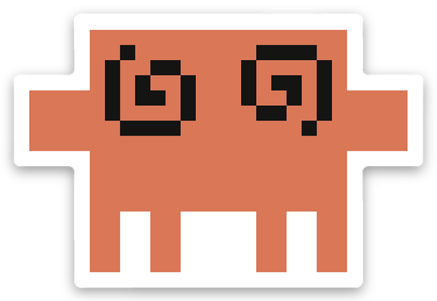
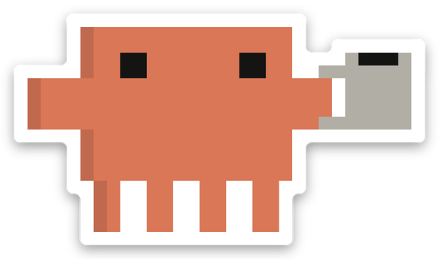

# Введение

Добро пожаловать в книгу о языке программирования Java.

Java — язык, на котором работает очень много того, что вас окружает: банковские
системы, торговые площадки, Android-приложения, поисковые движки, инструменты
обработки данных. Он появился в 1995 году и с тех пор пережил несколько эпох
программирования, ни разу не сломав обратную совместимость настолько, чтобы код
двадцатилетней давности перестал запускаться. Это одновременно его главная сила
и причина, по которой про Java ходит столько устаревших баек.

Книга описывает Java такой, какая она сейчас, — с записями, сопоставлением с
образцом, потоками данных и виртуальными потоками. Мы не будем учить вас писать
на Java 8 и потом переучивать.

## Почему Java

У языка есть несколько свойств, ради которых его выбирают, и стоит понимать их
заранее — тогда станет ясно, почему дальше в книге всё устроено именно так.

**Статическая типизация.** Тип каждой переменной известен до запуска программы.
Компилятор отказывается собирать код, в котором вы передали строку туда, где
ожидалось число. Это звучит как придирка, пока проект маленький; на проекте в
полмиллиона строк это разница между «переименовал метод и уверен, что ничего не
сломал» и «переименовал метод и надеюсь».

**Виртуальная машина.** Java-код компилируется не в машинные инструкции, а в
байт-код, который исполняет JVM — виртуальная машина. Она следит за памятью,
освобождая то, что вам больше не нужно, и оптимизирует программу прямо во время
работы, опираясь на то, как она реально исполняется. Поэтому долго работающий
Java-сервер часто быстрее, чем можно ожидать от «языка с виртуальной машиной».

**Обратная совместимость.** Библиотека, собранная десять лет назад, почти
наверняка заработает на сегодняшней JVM. Отсюда огромная экосистема: почти для
любой задачи уже есть зрелая библиотека.

**Многопоточность как часть языка.** Потоки, блокировки и модель памяти
описаны в спецификации языка, а не оставлены на усмотрение операционной
системы. С Java 21 к этому добавились виртуальные потоки, и цена одного
«потока» упала настолько, что их можно заводить сотнями тысяч.

Ничего из этого не бесплатно, и мы будем честно говорить о цене: JVM нужно
время на запуск, сборщик мусора иногда останавливает программу, а статическая
типизация требует писать типы. Язык без недостатков — это язык, про который вы
чего-то не знаете.

## Для кого эта книга

Мы предполагаем, что вы уже писали код на каком-нибудь языке — неважно, на
каком. Если вы знаете, что такое переменная, цикл и функция, этого достаточно.
Мы не будем объяснять, что программирование — это вообще такое.

Если Java — ваш первый язык, читать книгу можно, но местами придётся
притормаживать и гуглить. В таких местах мы будем стараться дать ссылку или
короткое объяснение в сноске.

Если вы приходите из языка с динамической типизацией — Python, JavaScript,
Ruby — самым непривычным будет не синтаксис, а то, что компилятор спорит с
вами до запуска программы. Если из C или C++ — непривычным будет отсутствие
ручного управления памятью и указателей. И то и другое мы разбираем подробно в
главе 4, она в этой книге ключевая.

## Как читать эту книгу

Книга рассчитана на последовательное чтение, от начала к концу. Поздние главы
опираются на ранние, а ранние иногда намеренно упрощают, обещая вернуться к
теме позже. Если такое обещание дано — оно будет выполнено.

Главы бывают двух видов. В **теоретических** главах мы разбираем одну идею
языка. В **проектных** — пишем работающую программу целиком, применяя то, что
уже прошли. Проектных глав три: 2, 13 и 21.

**Глава 1** — установка, первая программа, сборка проекта. **Глава 2** —
небольшая игра целиком, чтобы вы пощупали язык руками раньше, чем мы начнём
разбирать его по деталям. Если вы человек, которому неуютно писать код, не
понимая каждую строчку, — пропустите вторую главу и вернитесь к ней после
третьей.

**Глава 3** — переменные, типы, методы, ветвления и циклы: то, что в общих
чертах похоже на любой другой язык. **Глава 4** — модель памяти: стек, куча,
ссылки, `null` и сборщик мусора. Это самая важная глава книги. Большинство
загадочных ошибок в Java — не про синтаксис, а про то, что две переменные
неожиданно указывали на один и тот же объект.

**Главы 5–7** — объектная модель: классы, интерфейсы, полиморфизм, а затем
записи, запечатанные типы и сопоставление с образцом, которые за последние годы
изменили то, как на Java принято описывать данные.

**Главы 8–12** — ежедневный инструментарий: коллекции, исключения, обобщённые
типы, контракты `equals`/`hashCode` и тесты. **Глава 13** — первый большой
проект, программа командной строки.

**Главы 14–15** — функциональный стиль: лямбды, потоки данных, `Optional`.
**Главы 16–20** — программа в реальном мире: файлы, модули и зависимости,
многопоточность, виртуальные потоки. **Глава 21** — финальный проект:
многопоточный веб-сервер с нуля.

## Квизы

После большинства разделов вы найдёте небольшой квиз — два-три вопроса по
только что прочитанному.

Это не экзамен и никуда не отправляется: ответы сохраняются только в вашем
браузере. Смысл в другом. Чтение про язык программирования создаёт обманчивое
ощущение понимания: текст выглядит понятным, пока вас не попросят предсказать,
что напечатает программа. Квиз — самый дешёвый способ поймать этот разрыв
сразу, а не через три главы, когда станет непонятно уже всё.

Вопросы бывают трёх видов: выбрать правильный вариант, написать короткий ответ
и предсказать поведение программы — скомпилируется ли она, и если да, что
выведет. Последний вид самый полезный и самый неприятный.

Если вы ошиблись — это нормально и, скорее всего, означает, что раздел стоит
перечитать. Ошибиться на квизе дешевле, чем в рабочем коде.

## Ошибки в коде — это нормально

Ещё одна вещь, которую стоит сказать заранее. В книге много примеров, которые
**не компилируются**, и это сделано намеренно. Сообщения компилятора Java — не
препятствие на пути к работающей программе, а основной канал, по которому язык
с вами разговаривает. Мы будем показывать такие ошибки целиком и разбирать, что
именно компилятор пытается сказать.

Чтобы такие примеры не приходилось опознавать по контексту, они помечены
стикером в углу блока кода:

| Стикер | Что значит |
|---|---|
|  | Этот код не компилируется. Дальше в тексте разобрано, что именно не понравилось компилятору. |
|  | Этот код компилируется, но падает с исключением при запуске. |
|  | Этот код компилируется, не падает — и делает не то, что от него ожидали. Самая неприятная из трёх ситуаций. |

Разница между второй и третьей строкой важна, и мы будем возвращаться к ней
постоянно. Упавшая программа сообщает о проблеме сама. Программа, которая
молча делает не то, не сообщает ничего — её ошибку находит пользователь.

Если пример не помечен, а у вас не собирается — значит, где-то опечатка.

## Врезки

Кроме основного текста в книге есть врезки — абзацы, отчёркнутые слева
цветной полосой. В них вынесено то, что полезно знать, но что мешало бы, если
читать подряд. Пропустив врезку, вы ничего не сломаете в понимании темы.

Врезок три вида.

> **Современный подход:** так на Java пишут сейчас. Язык живёт тридцать лет, и
> значительная часть материалов о нём описывает практики, которые были верны в
> 2005 году и с тех пор устарели. В таких врезках мы говорим, как принято
> делать сегодня и почему прежний способ перестал быть хорошим — чтобы вы
> узнавали устаревший код, когда встретите его, и понимали, чем его заменить.

> **Под капотом:** как это устроено на уровне ниже. Для того чтобы пользоваться
> языком, эти подробности не нужны — но они превращают «просто так работает» в
> понимание. Читайте, если любопытно; возвращайтесь, когда что-то пойдёт не так.

> **Получилось:** короткая сводка в конце большой темы — что вы теперь умеете.

Начнём.
